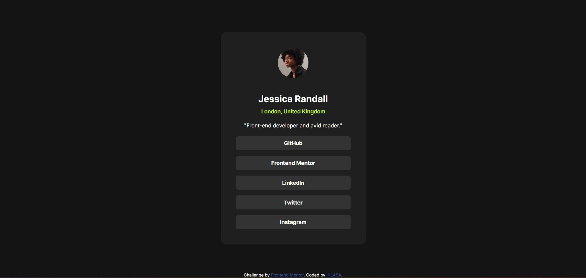
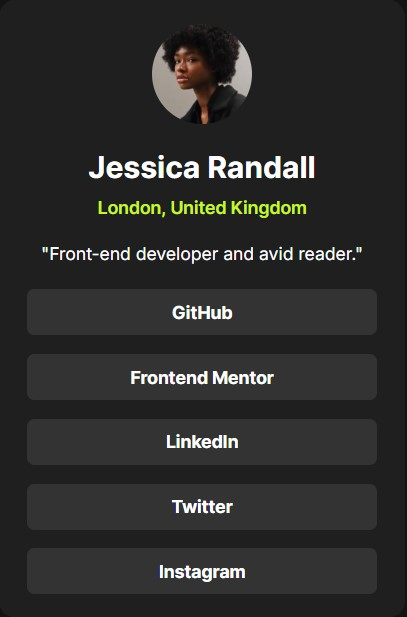

# Frontend Mentor - Social links profile solution

This is a solution to the [Social links profile challenge on Frontend Mentor](https://www.frontendmentor.io/challenges/social-links-profile-UG32l9m6dQ). Frontend Mentor challenges help you improve your coding skills by building realistic projects.

## Table of contents

- [Overview](#overview)
  - [Screenshot](#screenshot)
  - [Links](#links)
- [My process](#my-process)
  - [Built with](#built-with)

## Overview

Purpose:

This website is designed to provide a quick and engaging introduction to HTML and CSS, the fundamental building blocks of web development.

How to Use:

Hover over the buttons: As you hover your mouse over the buttons, you'll notice a change in color effect, drawing your attention to the content.
Read the Information: The page displays a brief overview of HTML and CSS, highlighting their roles in defining structure, content, and presentation.
Additional Notes:

The simple and visually appealing design makes the information easy to consume.
The use of a hovering effect adds an interactive element to the page.
In essence, this website offers a concise and visually engaging introduction to HTML and CSS, making it a great starting point for anyone interested in web development.

### Screenshot

### Links

- Solution URL: (https://github.com/gkilasonia/Social-links-profile)
- Live Site URL: (https://kilasa-social-links-profile.netlify.app/)

## My process

### Built with

- Semantic HTML5 markup
- CSS custom properties
- Flexbox
- Hover effect
- Mobile-first workflow
- Responsive design
